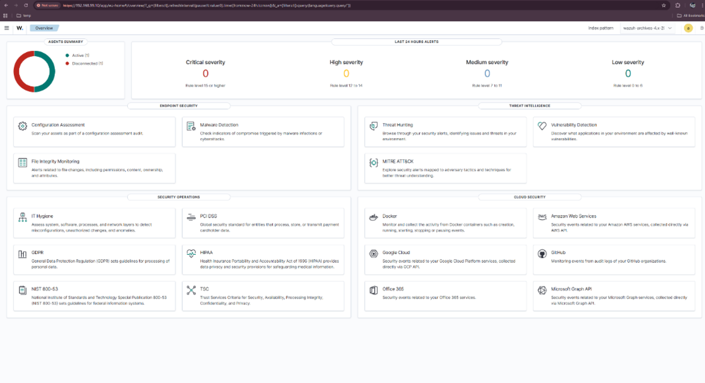
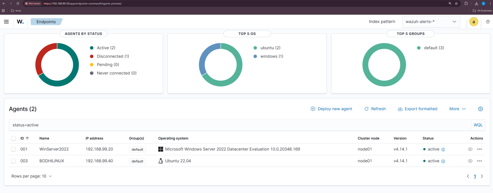
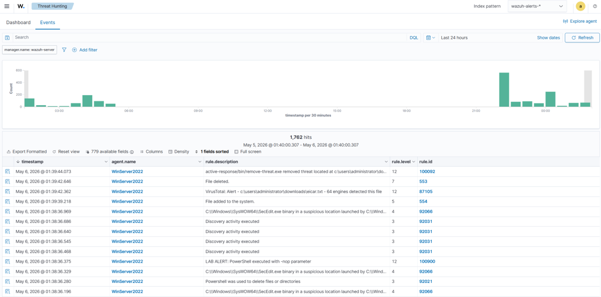
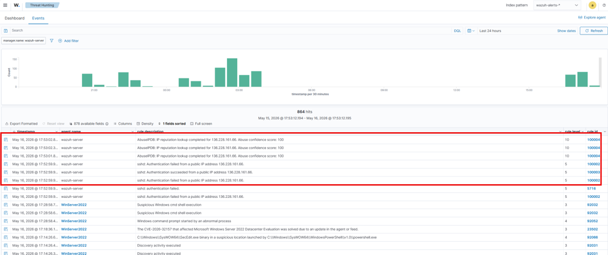
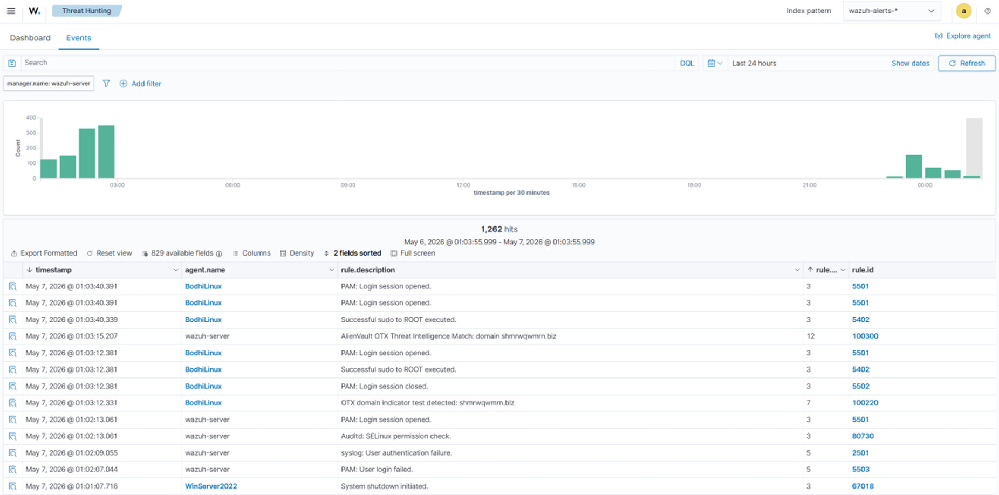

<div align="center">

# 🛡️ Wazuh XDR, SOAR & Threat Intelligence Lab

### Threat Intelligence & Threat Hunting Project

Wazuh SIEM • XDR Detection • SOAR Automation • Threat Intelligence Integration


</div>

---

# Overview

This project demonstrates the implementation of a Security Operations Center (SOC) environment using Wazuh SIEM, XDR detection capabilities, Shuffle SOAR automation, Active Response, and Threat Intelligence integrations.

The environment was configured to collect and analyze security events from Windows Server 2022, Bodhi Linux, and pfSense Firewall systems. Security incidents were detected using custom Wazuh rules, automatically responded to using Active Response and Shuffle playbooks, and enriched using external Threat Intelligence platforms.

The project simulates real-world SOC operations including threat detection, incident investigation, containment, automated response, and threat intelligence enrichment.

---

# Lab Environment

## Systems

| System | Purpose |
|----------|----------|
| Wazuh Server | SIEM Platform |
| Windows Server 2022 | Endpoint Monitoring |
| Bodhi Linux | Linux Endpoint |
| Kali Linux | Attack Simulation |
| pfSense Firewall | Firewall & Syslog Source |
| Shuffle | SOAR Platform |

---

# Technologies Used

## Security Monitoring

- Wazuh SIEM
- Custom Wazuh Rules
- Active Response

## Operating Systems

- Windows Server 2022
- Bodhi Linux
- Kali Linux

## Network Security

- pfSense Firewall
- Syslog Monitoring

## SOAR

- Shuffle
- Python Automation

## Threat Intelligence

- VirusTotal
- AbuseIPDB
- AlienVault OTX

## Scripting & Automation

- PowerShell
- Bash
- Python

---

# SOC Architecture


---

# Security Operations Workflow

```text
Data Collection
      │
      ▼
Detection
      │
      ▼
Analysis
      │
      ▼
Response
      │
      ▼
Continuous Monitoring
```

---

# Task 1 – Wazuh Configuration & Event Validation

## Wazuh Dashboard

Centralized monitoring of security events and system activity.



### Connected Agents

Windows Server 2022 and Bodhi Linux successfully connected to Wazuh.



### pfSense Firewall Integration

Firewall logs successfully forwarded to Wazuh using Syslog.


---

# Task 2 – XDR Detection & Automated Response

## Privilege Escalation Detection

Custom Wazuh rules detected unauthorized privilege escalation attempts.

**Rule IDs:** `100101`, `100102`


### Active Response Validation

Suspicious account automatically disabled after detection.


---

# Task 3 – SOAR Automation with Shuffle

## Shuffle Workflow

Automated incident response workflow integrating Wazuh alerts with response actions.


---

# Task 4 – Threat Intelligence Integration

## VirusTotal Integration

File reputation analysis and malware validation.

**Rule IDs:**

- 87105
- 100092



---

## AbuseIPDB Integration

IP reputation enrichment for suspicious network activity.

**Rule ID:** `100004`



---

## AlienVault OTX Integration

IOC and domain reputation analysis.

**Rule IDs:**

- 100220
- 100300
- 100301



---

# Key Results

| Capability | Status |
|------------|---------|
| Wazuh Deployment | ✅ |
| Windows Integration | ✅ |
| Linux Integration | ✅ |
| pfSense Integration | ✅ |
| Custom Detection Rules | ✅ |
| XDR Detection | ✅ |
| Active Response | ✅ |
| Shuffle SOAR Automation | ✅ |
| VirusTotal Integration | ✅ |
| AbuseIPDB Integration | ✅ |
| AlienVault OTX Integration | ✅ |

---

# Skills Demonstrated

## SIEM

- Wazuh Deployment
- Log Analysis
- Event Correlation
- Detection Engineering

## XDR

- Endpoint Monitoring
- Threat Detection
- Active Response

## SOAR

- Shuffle Automation
- Webhook Integration
- Automated Incident Response

## Threat Intelligence

- VirusTotal Integration
- AbuseIPDB Integration
- AlienVault OTX Integration
- IOC Analysis
- Threat Enrichment

## Security Operations

- Threat Hunting
- Incident Response
- Security Monitoring
- Alert Triage

---

# Repository Structure

```text
wazuh-xdr-soar-threat-intelligence
│
├── README.md
│
├── images
│   ├── soc-architecture.png
│   ├── wazuh-dashboard.png
│   ├── agents-connected.png
│   ├── pfsense-syslog.png
│   ├── privilege-escalation-alert.png
│   ├── account-disabled.png
│   ├── shuffle-workflow.png
│   ├── virustotal-detection.png
│   ├── abuseipdb-enrichment.png
│   └── otx-match.png
│
└── docs
    └── final-report.pdf
```

---

# Author

Threat Intelligence & Threat Hunting Project using:

- Wazuh SIEM
- Active Response
- Shuffle SOAR
- VirusTotal
- AbuseIPDB
- AlienVault OTX
- Windows Server 2022
- Bodhi Linux
- Kali Linux
- pfSense Firewall
